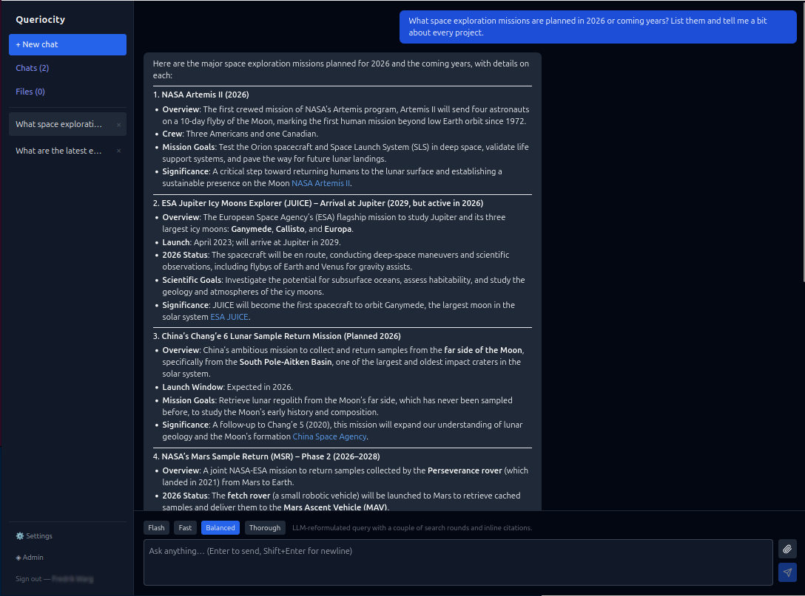

<p align="center"></p>

# Queriocity

> *Where **quer**y meets **curio**sity — and every answer carries its **cit**ations.*

Queriocity is a self-hosted, LLM-powered research assistant. It connects a local (or
OpenAI-compatible) language model to a private SearXNG search instance, stores your
conversation history and uploaded documents locally in SQLite, and serves everything
through a single Bun process.



---

## Requirements

| Dependency | Purpose |
|---|---|
| [Bun](https://bun.sh) ≥ 1.1 | Runtime & package manager |
| [SearXNG](https://docs.searxng.org/) | Private meta-search backend |
| Ollama or any OpenAI-compatible API | Language model serving |

---

## Installation

```bash
git clone https://github.com/fwarg/queriocity.git
cd queriocity
bun install
```

### Database

```bash
bun run db:generate   # generate migrations from schema
bun run db:migrate    # apply migrations (creates queriocity.db)
```

### Environment

Create a `.env` file (or set variables in your shell):

```dotenv
# ── Unified base URL (optional shorthand) ────────────────────────────────────
# If all your models are served from the same endpoint (e.g. LiteLLM, Ollama),
# set BASE_URL and BASE_PROVIDER once. Every service falls back to these unless
# overridden by its own *_BASE_URL / *_PROVIDER vars.
# BASE_URL=http://localhost:11434/api
# BASE_PROVIDER=openai              # "openai" or "ollama"; default: openai

# ── LLM: chat model ──────────────────────────────────────────────────────────
CHAT_PROVIDER=ollama                        # falls back to BASE_PROVIDER
CHAT_BASE_URL=http://localhost:11434/api    # falls back to BASE_URL
CHAT_MODEL=llama3.2

# ── LLM: thinking/reasoning model (researcher phase) ─────────────────────────
# Optional. When set, used for the researcher phase in thorough mode when the
# "Use thinking model" setting is enabled in the UI. Falls back to CHAT_* if unset.
# THINKING_PROVIDER=openai
# THINKING_BASE_URL=
# THINKING_MODEL=
# THINKING_API_KEY=

# ── LLM: small model (query reformulation) ───────────────────────────────────
# Optional. Use a fast 1–3 B model for best latency. Falls back to CHAT_* if unset.
# SMALL_PROVIDER=ollama
# SMALL_BASE_URL=http://localhost:11434/api
SMALL_MODEL=llama3.2

# ── LLM: embedding model ─────────────────────────────────────────────────────
EMBED_PROVIDER=ollama
EMBED_BASE_URL=http://localhost:11434/api   # falls back to CHAT_BASE_URL
EMBED_MODEL=nomic-embed-text
EMBED_DIMENSIONS=1536                       # must match the model's output size

# ── Reranker (optional) ───────────────────────────────────────────────────────
# When RERANK_MODEL is set, a cross-encoder reranker reorders accumulated sources
# by relevance before the thorough-mode writer pass, and reorders library search
# results. RERANK_BASE_URL defaults to BASE_URL if unset.
# RERANK_BASE_URL=http://localhost:8097
# RERANK_MODEL=
# RERANK_TOP_N=15                           # sources kept after reranking (default 15)

# ── SearXNG ───────────────────────────────────────────────────────────────────
SEARXNG_URL=http://localhost:4000
# SEARXNG_ENGINES=                          # comma-separated engine list; blank = SearXNG defaults

# ── Server ────────────────────────────────────────────────────────────────────
PORT=3000                                   # not used in Docker (see docker/compose.yml)
DB_PATH=queriocity.db                       # path to SQLite database file
JWT_SECRET=change-me-in-production-32chars!!
MAX_ATTACHMENT_CHARS=20000                  # max chars injected from a chat attachment (~4 chars/token)

# ── Reformulate context limits ────────────────────────────────────────────────
# The small model receives recent conversation history so it can resolve
# pronouns and follow-up references ("it", "that company", etc.) when
# rewriting queries. These caps bound how much history is injected, keeping
# the small model's context short for latency. (~4 chars ≈ 1 token)
# REFORMULATE_USER_CTX=400                  # max chars of prior user turns
# REFORMULATE_ASSISTANT_CTX=1000            # max chars of prior assistant turns
```

### Running

**Development** (hot-reload server + Vite dev server):

```bash
bun run dev           # server only (port 3000)
bun run dev:client    # Vite client (port 5173, proxies /api → 3000)
# or both at once:
bun run start
```

**Production**:

```bash
bun run build:client  # compile React app into dist/client/
bun run serve                # serve API + static files on a single port
```

Open `http://localhost:3000`. The first user to register becomes an admin.

---

## User management

- Registration requires an **invite link** generated by an admin in the Admin panel.
- Invites can optionally be scoped to a specific email address and expire after a set time.
- Admins can view all users and manage roles.

---

## Research modes

Queriocity runs every chat request in one of four focus modes, selectable per message in the chat input bar.

### Flash

Bypasses all search infrastructure entirely. The model answers directly from its training
knowledge with no web search, no query reformulation, and no tool calls. Responses are
capped at ~5 sentences. Use this for quick factual questions where sub-3s latency matters
and web freshness is not needed. Attachments are disabled in this mode. Query length is
capped at 200 characters.

The model used can be overridden via `FLASH_MODEL=small` to use the small/reformulation
model instead of the main chat model.

### Fast

A single pre-search query using the chat question directly is fired
and the results are injected before the model starts. The model streams its answer
directly and may issue one additional search if needed. A regex heuristic resolves pronouns in follow-up questions before searching — e.g. "When
was it founded?" after asking about a company becomes "When was [company] founded?" — so
the pre-search query is self-contained. Best for quick factual questions where you value
speed over depth.

Responses are always in the same language as the user's question.

- 1 pre-search query, 6 results
- Up to 2 LLM steps (think → answer)
- Model may call `web_search` once more if the pre-fetched results are insufficient

### Balanced *(default)*

A small model first rewrites the user's question into an optimized search query, which is
executed before the main model starts. For example, "what's the latest on the mars mission?"
might become `NASA Mars mission 2025 latest news`. The small model preserves the language of
the user's question, so Swedish queries produce Swedish search terms. The main model then
receives pre-fetched results and may issue one more round of searches (up to 2 queries at a
time) before answering. Answers include inline citations `[1][2]` and are always in the same
language as the user's question.

- 1 LLM-reformulated query pre-fetched in parallel
- Up to 4 LLM steps; up to 2 parallel search queries per step
- 8 results per query

### Thorough

A two-phase pipeline. Phase 1 is a dedicated **researcher** run: the model explores the
topic from multiple angles, calling `web_search` (up to 3 queries per call) up to 5 times
in total, finishing by calling a `done` tool. Phase 2 is a separate **writer** pass
that receives all deduplicated sources and synthesises a final, well-structured answer.
Slower, but significantly more comprehensive. Responses are always in the same language as
the user's question.

- Up to 3 pre-fetched queries (10 results each)
- Up to 5 LLM steps in the researcher; up to 3 search queries per step
- Separate writer model pass for the final answer
- If `RERANK_MODEL` is configured, accumulated sources are reranked by relevance before the writer pass, improving synthesis quality

> When a file is attached to the message, reformulation and pre-search are skipped entirely
> in all modes. The model reads the file content directly and decides autonomously whether
> any web search is needed.

---

## Attaching files

There are two distinct ways to bring file content into a conversation.

### Chat attachment (ephemeral)

Click the **paperclip** icon next to the message box and pick a file. The file is sent to
the server, its text is extracted (PDF text layer, OCR for images, plain text for
everything else), and up to `MAX_ATTACHMENT_CHARS` characters (default 20 000, ~5 000 tokens) of that text are injected into the message
you are about to send. The file is **not stored** — it lives only in that one message.

Use this when you want to ask a one-off question about a document: *"Summarise this
contract"*, *"What are the key findings in this paper?"*

Supported: PDF, images (PNG, JPG, TIFF, …), and any plain-text format.

### Library upload (persistent, vector-searchable)

Open the **Files** view in the sidebar. Upload a file there and it is ingested into the
library: the text is chunked, each chunk is embedded with the configured embedding model,
and the chunks + embeddings are stored in SQLite (via the `sqlite-vec` extension).

The model has access to an `uploads_search` tool in every conversation and can
semantically search your library at any time — even without you mentioning the file
explicitly. This is useful for building a personal knowledge base of PDFs, notes, or
research papers that the assistant can draw on across many conversations.

Max upload size: 50 MB.

---

## Custom instructions

In **Settings** you can add a custom prompt that is appended to the system prompt for every
request. Use this to set a persona, preferred language, citation style, or any standing
instruction.

---

## Docker

### Build

```bash
docker build -t queriocity .
```

### Configure

Copy `docker/env.template` to `docker/env.local` and fill in your values:

```bash
cp docker/env.template docker/env.local
# edit docker/env.local
```

Key differences from the bare-metal config:

- `DB_PATH=/data/queriocity.db` — the container writes the database to `/data`; mount a host directory there for persistence.
- If your LLM servers (Ollama, llama.cpp, SearXNG, etc.) run on the **host machine**, replace `localhost` with `host.docker.internal` in all `*_BASE_URL` and `SEARXNG_URL` values.
- `PORT` is not used in Docker — the container always listens on port 3000 internally. The external port is set in `docker/compose.yml` (`"8070:3000"` by default).

`docker/env.local` is excluded from the Docker image via `.dockerignore`.

### Run

```bash
docker compose -f docker/compose.yml up -d
```

The app is available at `http://localhost:8070` (or whatever external port is set in `compose.yml`).

The database is stored in `docker/data/queriocity.db` on the host — a plain file you can
inspect, back up, or copy directly. The `docker/data/` directory is excluded from git, so
create it before the first run:

```bash
mkdir -p docker/data
```

To stop without losing data:

```bash
docker compose -f docker/compose.yml down
```

If you prefer a Docker-managed volume instead, replace the `volumes:` block in `compose.yml`:

```yaml
# replace this:
    volumes:
      - ./data:/data

# with this:
    volumes:
      - queriocity-data:/data

volumes:
  queriocity-data:
```

The data will then live under `/var/lib/docker/volumes/docker_queriocity-data/` and is
managed by Docker rather than appearing as a regular directory.

`extra_hosts: host.docker.internal:host-gateway` is set in the compose file and is required
on Linux to make `host.docker.internal` resolve to the host. Docker Desktop on macOS/Windows
adds this automatically.

The schema is created automatically on first start — no separate migration step needed.

---

## Practical setup guide

Queriocity needs three external services: a **web search backend** (SearXNG), one or more **model servers** (llama.cpp recommended for local use), and optionally a **proxy layer** (LiteLLM) to give all your models a single unified endpoint. This guide walks through a typical self-hosted stack on Linux using Docker for SearXNG and LiteLLM, and bare-metal llama.cpp for the models.

### 1. SearXNG

The only required change from the default SearXNG config is to enable JSON output, which Queriocity's search calls depend on.

Create a `settings.yml` with at minimum:

```yaml
search:
  formats:
    - html
    - json
```

Run with Docker:

```bash
docker run -d \
  --name searxng \
  -p 8009:8080 \
  -v $(pwd)/searxng:/etc/searxng \
  searxng/searxng
```

Set `SEARXNG_URL=http://localhost:8009` in your Queriocity env. If Queriocity runs in Docker too, use `http://host.docker.internal:8009`.

### 2. llama.cpp model servers

Run `llama-server` in OpenAI-compatible mode for each model. Each model needs its own port.

```bash
# Large instruct model (main chat + researcher)
llama-server \
  --model /models/my-instruct-model.gguf \
  --host 0.0.0.0 --port 8095 \
  --ctx-size 8192 \
  --n-gpu-layers 99 \
  --threads 8

# Small/fast model (query reformulation)
llama-server \
  --model /models/my-small-model.gguf \
  --host 0.0.0.0 --port 8093 \
  --ctx-size 4096 \
  --n-gpu-layers 99 \
  --threads 4

# Embedding model
llama-server \
  --model /models/my-embed-model.gguf \
  --host 0.0.0.0 --port 8096 \
  --ctx-size 512 \
  --n-gpu-layers 99 \
  --embedding --pooling mean
```

**Hybrid thinking models** (e.g. Qwen3): llama.cpp exposes a single server for both thinking and non-thinking variants. You control which mode to use via `enable_thinking` in the LiteLLM config (see below) — no separate server flag is needed.

### 3. LiteLLM proxy

LiteLLM maps friendly model names to your llama.cpp backends and exposes a single OpenAI-compatible endpoint. This lets Queriocity use one `BASE_URL` for all models.

**`litellm_config.yaml`**:

```yaml
model_list:
  - model_name: my-chat-model
    litellm_params:
      model: openai/my-chat-model
      api_base: http://host.docker.internal:8095/v1
      api_key: none

  # For hybrid thinking models: two entries pointing at the same server,
  # one with thinking enabled and one without.
  - model_name: my-think-model
    litellm_params:
      model: openai/my-chat-model
      api_base: http://host.docker.internal:8095/v1
      api_key: none
      extra_body:
        chat_template_kwargs:
          enable_thinking: true

  - model_name: my-small-model
    litellm_params:
      model: openai/my-small-model
      api_base: http://host.docker.internal:8093/v1
      api_key: none

  - model_name: my-embed-model
    litellm_params:
      model: openai/my-embed-model
      api_base: http://host.docker.internal:8096/v1
      api_key: none
      mode: embedding
      custom_llm_provider: openai
```

Run LiteLLM via Docker:

```yaml
# docker-compose.yml
services:
  litellm:
    image: docker.litellm.ai/berriai/litellm:main-stable
    ports:
      - "8088:4000"
    volumes:
      - ./litellm_config.yaml:/app/config.yaml
    command: --config /app/config.yaml
    extra_hosts:
      - "host.docker.internal:host-gateway"   # required on Linux
```

```bash
docker compose up -d
```

### 4. Queriocity env

With LiteLLM running on port 8088, configure Queriocity using `BASE_URL` so all models route through it:

```dotenv
BASE_URL=http://localhost:8088/v1    # or host.docker.internal:8088/v1 if in Docker
BASE_PROVIDER=openai

CHAT_MODEL=my-chat-model
SMALL_MODEL=my-small-model
EMBED_MODEL=my-embed-model
EMBED_DIMENSIONS=1536               # match your embedding model's output size

# Optional: dedicated thinking model for thorough mode researcher phase
THINKING_MODEL=my-think-model

SEARXNG_URL=http://localhost:8009

JWT_SECRET=                         # generate with: openssl rand -base64 32
DB_PATH=./queriocity.db
```

See the [Environment](#environment) section for the full reference.

### Reranker (optional)

llama.cpp supports reranking via the `--reranking` flag. Run a cross-encoder model on its own port:

```bash
llama-server \
  --model /models/my-reranker-model.gguf \
  --host 0.0.0.0 --port 8097 \
  --n-gpu-layers 99 \
  --reranking
```

Add the model to your LiteLLM config:

```yaml
  - model_name: my-reranker-model
    litellm_params:
      model: hosted_vllm/my-reranker-model   # hosted_vllm is a LiteLLM workaround; backend is llama.cpp
      api_base: http://host.docker.internal:8097
      api_key: none
      mode: rerank
```

Then set in your Queriocity env:

```dotenv
RERANK_BASE_URL=http://localhost:8088/v1   # via LiteLLM, or point directly at port 8097
RERANK_MODEL=my-reranker-model
```

---

## Architecture overview

```
Browser (React + Vite)
        │  SSE stream
        ▼
Hono server (Bun)
  ├── /api/auth      — register, login (JWT + bcrypt)
  ├── /api/chat      — reformulate → pre-search → researcher → [writer]
  ├── /api/files     — upload/extract/list/delete
  ├── /api/history   — chat sessions + messages
  ├── /api/admin     — user & invite management
  └── /api/users     — user settings
        │
        ├── SearXNG   (meta-search)
        ├── Ollama / OpenAI-compatible API
        ├── Reranker API (optional, cross-encoder)
        └── SQLite + sqlite-vec   (queriocity.db)
```

---

## Dependencies and licenses

All direct runtime dependencies use **MIT** or **Apache 2.0** licenses.

| Package | License | Purpose |
|---|---|---|
| `hono` | MIT | HTTP server framework |
| `@hono/zod-validator` | MIT | Request validation middleware |
| `ai` (Vercel AI SDK) | Apache 2.0 | LLM streaming & tool-call abstraction |
| `@ai-sdk/openai` | Apache 2.0 | OpenAI-compatible provider adapter |
| `ollama-ai-provider` | MIT | Ollama provider adapter |
| `zod` | MIT | Schema validation |
| `jose` | MIT | JWT signing & verification |
| `bcryptjs` | MIT | Password hashing |
| `drizzle-orm` | Apache 2.0 | Type-safe SQLite ORM |
| `sqlite-vec` | MIT | Vector similarity search in SQLite |
| `pdf-parse` | MIT | PDF text extraction |
| `pdfjs-dist` | Apache 2.0 | PDF rendering (canvas fallback) |
| `tesseract.js` | Apache 2.0 | OCR for image attachments |
| `react` / `react-dom` | MIT | UI framework |
| `react-markdown` | MIT | Markdown rendering |
| `lucide-react` | ISC | Icon library |

Dev dependencies (`vite`, `tailwindcss`, `drizzle-kit`, `@vitejs/plugin-react`, Babel
plugins, type stubs) are likewise MIT or Apache 2.0.

This project is licensed under **MIT**. It is compatible with all dependencies listed
above: MIT packages impose no downstream restrictions, and Apache 2.0 packages may be
included in MIT-licensed projects provided their copyright and license notices are
retained (which standard `node_modules` handling already does).

---

## License

MIT — see [LICENSE.md](LICENSE.md)
