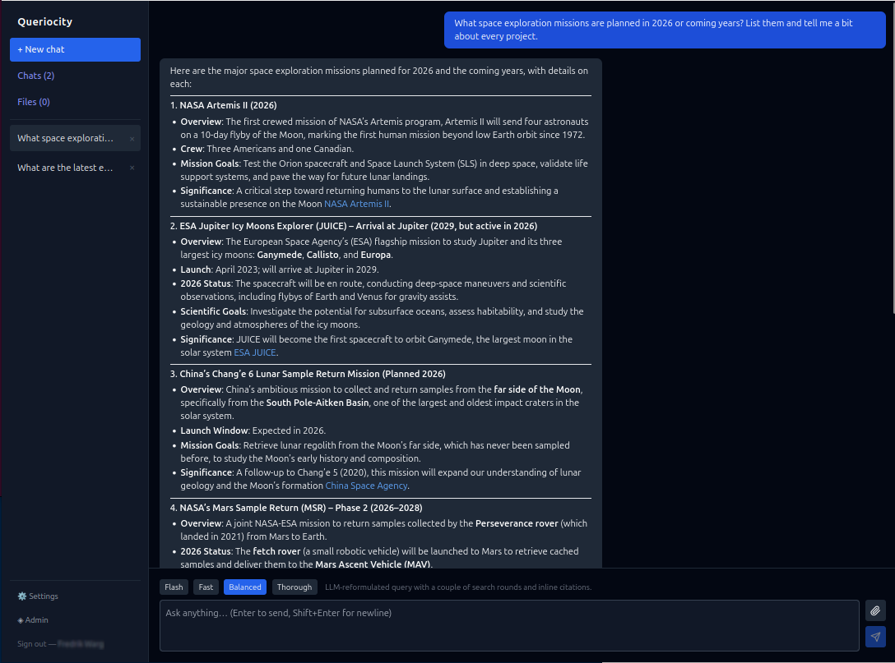

<p align="center"></p>

# Queriocity

> *Where **quer**y meets **curio**sity — and every answer carries its **cit**ations.*

Queriocity is a self-hosted, LLM-powered research assistant. It connects a local (or
OpenAI-compatible) language model to a private SearXNG search instance, stores your
conversation history and uploaded documents locally in SQLite, and serves everything
through a single Bun process.



---

## Contents

- [User guide](#user-guide)
  - [What is Queriocity](#what-is-queriocity)
  - [Chats](#chats)
    - [Text-to-speech](#text-to-speech)
    - [Retrying an answer](#retrying-an-answer)
    - [Follow-up suggestions](#follow-up-suggestions)
    - [Exporting a chat](#exporting-a-chat)
    - [Connection recovery](#connection-recovery)
    - [Searching chats](#searching-chats)
    - [Searching within a chat](#searching-within-a-chat)
  - [Research modes](#research-modes)
    - [Search category filtering](#search-category-filtering)
  - [Resources](#resources)
    - [Chat attachment (ephemeral)](#chat-attachment-ephemeral)
    - [Library upload (persistent)](#library-upload-persistent-vector-searchable)
    - [URL and YouTube ingestion](#url-and-youtube-ingestion)
  - [URL fetching](#url-fetching)
  - [Prompt templates](#prompt-templates)
    - [Prompt Studio](#prompt-studio)
  - [Settings](#settings)
  - [Image generation](#image-generation)
  - [Spaces](#spaces)
    - [How memory works](#how-memory-works)
    - [Memory about you](#memory-about-you)
  - [Monitors](#monitors)
- [Installation guide](#installation-guide)
  - [Requirements](#requirements)
  - [Installation](#installation)
  - [Environment variables](#environment-variables)
  - [Running](#running)
  - [Docker](#docker)
  - [Example deployment](#example-deployment)
- [Admin guide](#admin-guide)
  - [User management](#user-management)
  - [System settings](#system-settings)
  - [Importing from Claude AI](#importing-from-claude-ai)
  - [Backup](#backup)
- [Architecture overview](#architecture-overview)
- [Dependencies and licenses](#dependencies-and-licenses)
- [License](#license)

---

# User guide

## What is Queriocity

Queriocity is a private research assistant you run on your own hardware. It is designed for:

- **Research questions** — ask anything and get a cited answer backed by live web search
- **Document Q&A** — attach PDFs, images, or text files and interrogate them in conversation
- **Persistent knowledge base** — upload documents to your library so the assistant can draw on them across many conversations
- **Contextual workspaces** — group related chats into spaces with shared memory and file references
- **An assistant that remembers** — spaces accumulate facts from your conversations and recall the ones relevant to each question; optionally, a short personal profile applies across every chat

## Chats

Start a chat from the sidebar. Type a question and choose a [research mode](#research-modes) before sending. Follow-up questions resolve pronouns and references automatically ("When was it founded?" after asking about a company works as expected). Chats can be assigned to a [space](#spaces) at any time from the chat header.

The first message in a chat can be collapsed to save space — useful when the prompt is long or contains an attachment. Click the **▾** icon in the top-right corner of the message to collapse it; click the truncated preview to expand it again. When opening a monitor run session the first message (the recurring query) is collapsed by default.

The **chat input bar** at the bottom can also be collapsed to give the full viewport height to the conversation. Click the chevron (▾ / ▴) at the top of the input area to toggle between collapsed and expanded.

### Text-to-speech

Every assistant message has a small **speaker icon** (🔊) in its bottom-right corner. Click it to have the response read aloud using the browser's built-in Web Speech API. The icon turns blue and switches to a stop icon (🔇) while speaking; click again to stop. Starting a new message automatically cancels the previous one. Markdown syntax, code blocks, and citation markers are stripped before reading.

The **Chats** view lists all your conversations with infinite scroll. Use the **Active / Created** toggle in the top-right to sort by most recently active or by creation date.

### Retrying an answer

Under a finished answer, **Retry** re-runs the same question and replaces the previous answer
rather than appending a second one. To retry *differently*, change the research mode (or the
search categories) first and then hit Retry — the retry uses whatever is selected at that
moment. Retries always bypass the short-lived answer cache, so you get a genuinely new run.

### Answer cache

Identical questions are cached for 5 minutes and replayed instantly. The cache key covers the
question, the research mode, your user and space, any pinned files or memories, your custom
prompt, **and the preceding conversation** — so the same follow-up wording ("Is it officially
shut down?") in two different chats does not collide. A replayed answer is a full turn: it is
saved to the conversation and carries its sources, so citations remain clickable. Failed
generations are never cached.

### Follow-up suggestions

After a substantial answer, up to three suggested follow-up questions appear as chips below
it. Click one to ask it. They are generated by the flash model from the question and answer,
and are skipped entirely for short answers, images, and cancelled runs — if the model is slow
or unavailable, no chips appear and nothing else is affected. Turn them off per user in
**Settings** (see [Settings](#settings)); disabling skips the call rather than hiding its result.

### Exporting a chat

The **Export ▾** menu under a finished chat offers:

- **Download full chat (.md)** — every message, with sources.
- **Download last answer (.md)** — the final assistant message only, handy after asking for a
  summary.
- **Print / Save as PDF…** — opens the browser's print dialog; choose "Save as PDF" as the
  destination to get a file. The printed page drops the sidebar, input box and on-screen
  controls, and prints black-on-white regardless of the dark theme. Text stays selectable and
  links stay clickable. The filename comes from the browser, not from the chat title.

Only what is currently expanded gets printed — expand a collapsed sources list or thinking
block first if you want it included.

### Connection recovery

Long answers survive a dropped connection. The server keeps generating for
`STREAM_RESUME_GRACE_MS` (default 90 s) after the browser disappears, buffering everything it
produces; when the browser comes back it asks for what it missed and the answer continues
where it left off, rather than restarting or being lost. Pressing **Stop** cancels the run
explicitly, so stopping still stops.

### Searching chats

The search box at the top of the Chats view searches both **chat titles and message content** across your full history. Results appear after a short debounce and are capped at 100 matches. The sidebar also has a quick title-only filter for the currently loaded chats.

### Searching within a chat

Press **Ctrl+F** (or click the 🔍 icon in the chat header) to open an in-chat search bar. Matching messages are highlighted with a yellow ring and the active match scrolls into view. Use **▲ ▼**, **Enter** / **Shift+Enter** to navigate between matches; **Escape** closes the bar. Text matches are also highlighted inline in user messages.

## Research modes

Queriocity runs every chat request in one of three research modes (Flash, Balanced, Thorough), selectable per message in the chat input bar. A fourth **Image** mode is available when `IMAGE_BASE_URL` is configured — see [Image generation](#image-generation).

### Flash

Bypasses all search infrastructure entirely. The model answers directly from its training
knowledge with no web search, no query reformulation, and no tool calls. Responses are
capped at ~5 sentences. Use this for quick factual questions where latency matters
and web freshness is not needed. Attachments are disabled in this mode. Query length is
capped at 200 characters.

The model used in flash mode can be overridden via `FLASH_MODEL=small` to use the 
small/reformulation model instead of the main chat model. Leaving it unset is a perfectly good
setup: flash is fast because it skips search, reformulation, tool calls and multi-step rounds —
that is where the time goes — not because of which model answers.

### Balanced *(default)*

A small model first rewrites the user's question into optimized search queries, which are
executed before the main model starts. For example, "what's the latest on the mars mission?"
might become `NASA Mars mission 2026 latest news`. The main model then
receives pre-fetched results and may issue further searches (up to 2 queries at a
time) before answering. Answers include inline citations `[1][2]` and are always in the same
language as the user's question. Hovering a `[N]` marker shows the source's title, domain and
a short snippet; clicking it highlights that source in the list below the answer.

The rewrite is instructed to keep any wording that pins down *which* thing you mean — an
apposition ("DOGE, the department run by Elon Musk"), a field, a company, a time period — even
though it otherwise strips the question down to keywords. Dropping such a qualifier sends the
search to a different subject entirely. As a backstop, your original question is searched
alongside the rewrites whenever it is short enough (≤12 words) to make a usable query and no
rewrite already covers it, and a rewrite that mangles a name you wrote (splitting "DOGE" into
"do ge") is discarded.

Within a turn, a follow-up search that merely rephrases one already run is skipped and the model
is told to try a different angle instead — with only two tool rounds, a repeated query costs a
quarter of the mode's entire search budget.

The final step is reserved for writing: on it the search and fetch tools are withheld
entirely, so the model can only produce prose. Without this a model facing weak search results
can spend every step searching and write nothing at all, leaving the answer to a single-shot
fallback pass. Thorough mode is exempt, since its writer phase always runs.

Query reformulation can be disabled in **Admin > System settings > Search** for setups where small-model latency is a concern — the raw user query is then sent directly to search.

- 2 LLM-reformulated pre-fetched queries, plus your raw question when it qualifies as a backstop (or the raw query alone when reformulation is disabled)
- Up to 3 LLM steps, of which the first 2 may call tools (the last writes the answer); up to 2 parallel search queries per step
- 8 results per web-search query
- If `RERANK_MODEL` is configured, pre-fetched results are reranked by relevance and pruned to **Top N** before the model sees them

### Thorough

A two-phase pipeline. Phase 1 is a dedicated **researcher** run: the model explores the
topic from multiple angles, calling `web_search` (up to 3 queries per call) up to 5 times
in total, finishing by calling a `done` tool — which ends the research phase immediately,
so a run that gathers what it needs early doesn't pay for the remaining steps. Phase 2 is a
separate **writer** pass that receives all deduplicated sources and synthesises a final,
well-structured answer. Slower, but significantly more comprehensive. Responses are always in
the same language as the user's question.

Your custom prompt (**Settings → Personalization**) and any injected memories apply to the
writer pass as well as the researcher, so an instruction like "always answer in Swedish" or
"be concise" governs the answer you actually see.

- Up to 3 pre-fetched queries (10 results each), plus your raw question as a backstop on the same terms as balanced
- Up to 5 LLM steps in the researcher; up to 3 search queries per step, with repeats of an earlier query skipped
- Separate writer model pass for the final answer
- If `RERANK_MODEL` is configured, accumulated sources are reranked by relevance and pruned to **Top N** before the writer pass, improving synthesis quality
- The sources handed to the writer are fitted to the context budget (`CONTEXT_TOKEN_LIMIT`): each is trimmed to an equal share, and the lowest-ranked are dropped rather than clipping every source below the length that can support a citation

### Search category filtering

In **Balanced** and **Thorough** modes, an **All ▾** button appears at the right end of the mode row. Click it to restrict search to one or more topic categories:

| Category | SearXNG equivalent |
|---|---|
| **news** | news engines |
| **science** | science engines |
| **discussions** | social media / forum engines |
| **tech** | IT / technology engines |

Categories are multi-select — e.g. "news+science" searches both simultaneously. When no category is selected (the default), all engines are used. The button label shows the active selection (e.g. `news+discussions ▾`).

---

## Resources

There are three ways to bring file content into a conversation.

### Chat attachment (ephemeral)

Click the **paperclip** icon next to the message box and pick a file. The file is sent to
the server, its text is extracted (PDF text layer, OCR for images, plain text for
everything else), and up to the configured character limit (default 20 000, ~5 000 tokens) of that text are injected into the message
you are about to send. The file is **not stored** — it lives only in that one message.

The character limit is configurable in **Admin > System settings > Attachments**.

Use this when you want to ask a one-off question about a document: *"Summarise this
contract"*, *"What are the key findings in this paper?"*

Supported: PDF, plain text, Markdown, CSV, HTML, and images (via vision LLM with Tesseract OCR fallback)

> When a file is attached to the message, reformulation and pre-search are skipped entirely
> in all research modes. The model reads the file content directly and decides autonomously whether
> any web search is needed.

### Library upload (persistent, vector-searchable)

Open the **Resources** view in the sidebar. Upload a file there and it is ingested into the
library: the text is chunked, each chunk is embedded with the configured embedding model,
and the chunks + embeddings are stored in SQLite (via the `sqlite-vec` extension).

In balanced and thorough modes, if you have files in your library, relevant excerpts are automatically retrieved and injected as context (see also 'spaces' where the behaviour is a bit different). The model also has access to an `uploads_search` tool in every conversation and can semantically search your library at any time — even without you mentioning the file
explicitly.

The library is useful for building a personal knowledge base of PDFs, notes, or research papers that the assistant can draw on across many conversations.

Max upload size: 50 MB.

### URL and YouTube ingestion

Click **+ Add URL** in the Resources view to permanently ingest a web page or YouTube video into your library. The content is fetched server-side, chunked, embedded, and stored exactly like an uploaded file.

- **Web pages** — the page is fetched and its text extracted (same pipeline as the `fetch_url` tool).
- **YouTube videos** — paste any YouTube URL (`youtube.com/watch?v=…`, `youtu.be/…`, shorts, embeds) and the video's transcript is fetched automatically via the YouTube transcript API. No local download or `yt-dlp` required. The transcript is stored as a searchable document.

Ingested URLs work the same as uploaded files: they appear in the Resources list, can be tagged to spaces, and are available to the `uploads_search` tool.

---

## URL fetching

There are two ways page content reaches the model, and they share the same fetching and budgeting logic below:
- **Pasted URLs** — when a message contains a URL, Queriocity fetches the full page content server-side and injects it into the conversation before the model runs, no copy-paste needed.
- **The `fetch_url` tool** — the model can also fetch URLs autonomously mid-research, e.g. to read a search result in full, or to follow up on a URL mentioned in conversation.

- **Static fetch first** — a lightweight HTTP request strips scripts, styles, and navigation elements to extract readable text. Fast and proxy-friendly.
- **Playwright fallback** — if the static fetch returns too little content (JS-rendered pages, login walls that redirect), a headless Chromium instance renders the page and extracts `innerText`.
- **Pagination** — for pasted URLs, up to `FETCH_MAX_PAGES` pages are fetched automatically by appending `?page=2`, `?page=3`, etc. Stops on error, short content, duplicate content, or when two consecutive pages have the same length (e.g. file-listing pagination with identical structure). Overridable per-instance in Admin → Settings. The `fetch_url` tool fetches one page per call; the model can call it again with its own `?page=2` if it needs more, subject to the per-turn budget below.
- **Raw scrape ceiling** — each single fetch (one page) is capped at `FETCH_MAX_CHARS` chars (default 100 000) of extracted text before it's cached. This only bounds how much is scraped and kept in memory — it does *not* by itself limit what reaches the model; see the next two limits for that. It must stay ≥ `FETCH_MAX_URL_CONTEXT_CHARS` (below) or it silently clips content before the context cap or summarizer ever run; a startup warning is logged if misconfigured.
- **Per-URL context cap** — before a page's content is injected into the model's context, it's capped at `FETCH_MAX_URL_CONTEXT_CHARS` (default 40 000 chars), applied identically whether the URL was pasted by the user or fetched by the model's own `fetch_url` tool. If the *Summarize oversized URL content* admin setting is enabled, content over the cap is compressed by the small model in serial chunks (`FETCH_SUMMARIZE_MAX_CHUNKS`, default 6) instead of being hard-truncated.
- **Per-turn cumulative budget** — `fetch_url` and `web_search` calls made by the model during one research turn draw from a single shared budget, derived from `CONTEXT_TOKEN_LIMIT` (roughly 80% of the model's real context window, minus what the system prompt and conversation history already use). A fixed fraction of that budget (`TOOL_BUDGET_RESERVE_FRACTION`, default 30%) is reserved for this pool *before* conversation history is trimmed, so a long conversation can never leave the tools with no room to work. Every call consumes from the pool as it goes; once it's nearly exhausted, further `fetch_url`/`web_search` calls are refused and the model is told to answer with what it already has instead of erroring. This is what actually protects against context overflow once an agentic research turn is underway — a `thorough`-mode run can call these tools many times across several steps, and this cap holds regardless of how high `FETCH_MAX_CHARS` is set for scraping purposes.
- **History compaction** — when conversation history must be trimmed to make room (for the tool budget above), the oldest messages are dropped by default. If the *Compress dropped history* admin setting is enabled, they're summarized by the small model and folded into the system prompt instead, preserving continuity at the cost of an extra LLM call. Only applies to balanced/thorough research turns.
- **Blocked targets** — fetches are restricted to `http`/`https`, and the hostname is resolved and rejected if it points at a loopback, private (RFC1918/CGNAT), link-local (including the `169.254.169.254` cloud-metadata address) or otherwise internal address. The check runs on the original URL *and* on every redirect hop, so a public URL cannot bounce a fetch onto your LAN. This matters because the model can be talked into fetching a link it read in a page or a search result — without the guard, a planted URL reaches your Ollama, SearXNG or LiteLLM instance. A refusal comes back to the model as `Error fetching <url>: <reason>`. To fetch internal pages deliberately (an intranet wiki, say), set `FETCH_ALLOW_PRIVATE_HOSTS=true`; a warning is logged at startup while it is on.
- **Timeout** — each attempt is capped at `FETCH_TIMEOUT_MS` (default 10 s), applied separately to the static fetch and to the Playwright render, so an unreachable page costs at most roughly double that before the model is told it failed.
- **Cache** — fetched URLs are cached for 5 minutes so the model does not re-fetch during the same session.
- **Privacy** — by default requests originate from the server's IP. Set `FETCH_PROXY_URL` to route all fetches through an HTTP or SOCKS5 proxy (e.g. [Privoxy](https://www.privoxy.org/) → Tor).

---

## Prompt templates

Click the **template icon** (grid icon) in the chat input bar to open the template picker. Templates assemble a structured prompt from a short form — no need to craft the wording yourself. Each template also sets the suggested research mode automatically.

| Template | Suggested mode | Description |
|---|---|---|
| Research deep-dive | Thorough | Structured report on a topic from a specific angle |
| Compare & Analyze | Balanced | Side-by-side comparison with a recommendation |
| Explain / Teach | Flash | Concept explanation tailored to a chosen audience |
| Latest news on | Balanced | Current developments on a topic with implications |
| Draw / Illustrate | Image | Image generation with style, lighting, and quality controls (requires `IMAGE_BASE_URL`) |

Fill in the required fields (marked `*`), adjust optional ones, and click **Use template** to populate the chat input. You can edit the assembled text before sending.

Custom templates you create in [Prompt Studio](#prompt-studio) appear below the built-in ones under a **Custom** heading.

### Prompt Studio

Prompt Studio is a built-in editor for creating and iterating on your own prompt templates. Access it from the **"Create custom template"** button at the bottom of the template picker.

**Workflow:**

1. Write a prompt in the editor. Use `{{placeholder}}` syntax to mark variable parts — e.g. `Explain {{concept}} to a {{audience}} in under {{words}} words.`
2. The Studio automatically detects your placeholders and shows a **Test values** panel with one input per field.
3. Fill in test values (or leave them blank — unfilled placeholders default to the field name so the run still makes sense), pick a mode, and click **▶ Run** to see the output stream in.
4. Iterate: edit the prompt, adjust values, run again.
5. When satisfied, give the template a name and click **Save template**.

Saved templates appear in the template picker under **Custom**. Each card has always-visible **Edit** (pencil) and **Delete** (trash) buttons. Tapping delete requires a confirmation step (a **Del** / **✕** pair appears inline) to prevent accidental deletion. Editing re-opens Prompt Studio pre-filled with the existing template.

Templates are stored per user in the database and persist across sessions.

---

## Settings

Open **Settings** from the bottom of the sidebar. Settings are saved per user.

| Setting | Description |
|---|---|
| **Custom system prompt** | Text appended to the assistant's instructions on every request. Use it to set a persona, preferred language, citation style, or standing instructions. |
| **Show search process** | Display search queries and result snippets in a collapsed block before the answer. Toggleable separately for Balanced and Thorough modes. |
| **Model thinking** | Use the `THINKING_MODEL` for the researcher phase in Thorough mode. Requires a reasoning-capable model (e.g. Qwen3). Falls back to the chat model if `THINKING_MODEL` is not configured. |
| **Space RAG** | When chatting in a space, retrieve relevant past messages and document excerpts semantically on top of the fixed memory block. |
| **Chat RAG** | When chatting outside a space, automatically retrieve relevant excerpts from your uploaded file library and inject them as context. |
| **Query suggestions** | Show AI-generated query completions as you type in the chat input (debounced, min 8 characters). Powered by the flash model. Disable on slow setups or if the extra latency is distracting. |
| **Follow-up suggestions** | Show up to three suggested follow-up questions as chips under a finished answer. Powered by the flash model, one call per answer. Disabling it skips the call entirely. |
| **About you** | Off by default. Keeps a short list of facts about you that apply in *every* chat, space or not, and lets you build it by hand or from a reviewed scan of your recent chats. See [Memory about you](#memory-about-you). |
| **Font size** | UI font size: Small (15 px), Normal (17 px), Large (19 px), XL (21 px). Sizes scale up automatically on narrow viewports. |
| **Timezone** | IANA timezone (e.g. `Europe/Stockholm`) used when scheduling monitors at a specific hour of the day. Defaults to server time (UTC in Docker) if not set. |
| **Password** | Change your password. Requires the current one; the new one needs 8+ characters with upper and lower case, a digit and a symbol. Changing it signs out your other devices but keeps the current session. |

---

## Image generation

When `IMAGE_BASE_URL` is configured, Queriocity gains a dedicated **Image** mode for generating and editing images using a local diffusion server. The model has three tools:

- **`web_search`** — automatically researches specialized or unfamiliar subjects before generating, so the image prompt can be enriched with accurate visual context
- **`generate_image`** — creates a new image from a text description
- **`edit_image`** — modifies a previously generated image based on a new description

The model decides whether to search first based on topic familiarity. If it does, a one-sentence summary of what was learned appears above the image. Tool orchestration always runs on `CHAT_MODEL` — `FLASH_MODEL=small` does not apply here, because choosing sizes, step counts and edit strengths reliably needs the larger model. Blocked search engines are reported the same way as in the other modes, and image-mode searches draw on the same `SEARCH_API_MAX_PER_REQUEST` fallback budget.

### Usage

Select **Image** mode and describe what you want:

> *"Draw a mountain landscape at sunset"*
> *"Generate a portrait of a robot reading a book, high quality"*
> *"Make it raining"* — (edits the most recently generated image)

The model calls the appropriate tool automatically. While the image is being generated, a **"Generating image…"** or **"Editing image…"** status indicator is shown. When done, the image is displayed inline with a **Download PNG** link.

### Quality hints

The model maps quality keywords to inference step counts:

| Hint in your message | Steps |
|---|---|
| *draft*, *quick*, *fast* | ~15 |
| *(none / default)* | ~25 |
| *high quality*, *detailed*, *best* | ~40 |

You can also request a specific resolution: *"512×512"*, *"1024×576"*, etc.

### Image storage

Generated images are stored on the server (per user) and served via `/images/<user-id>/<filename>.png`. They are tied to the conversation and deleted when the chat is deleted.

### Requirements

A diffusion server that exposes OpenAI-compatible `/v1/images/generations` and `/v1/images/edits` endpoints is required. [ComfyUI](https://github.com/comfyanonymous/ComfyUI) with the openai-compatible API, [A1111](https://github.com/AUTOMATIC1111/stable-diffusion-webui) with the `--api` flag, or any server that implements the OpenAI image API will work.

Set `IMAGE_BASE_URL` in your environment to enable the feature (see [Environment variables](#environment-variables)).

---

## Spaces

**Spaces** are named workspaces that group related chats together. Each space has:

- A persistent **memory store** — facts extracted from conversations, injected into future system prompts
- A **chat history index** — full message content embedded for semantic retrieval
- **Tagged files** — library documents linked to the space for contextual retrieval

### Assigning chats to spaces

Chats can be assigned or reassigned to spaces from the chat header or space detail view. When a chat is first assigned to a space, memories are retroactively extracted and the chat history is indexed for RAG. Auto-extracted memories follow the chat if it is moved or removed.

### RAG (retrieval-augmented generation)

When a space has a RAG budget configured (Admin > System settings), each request performs semantic retrieval on top of the fixed memory block:

- **Chat history RAG** — past messages in the space are chunked and embedded. The chunks most relevant to the current query are injected as `## Relevant past conversations` in the system prompt, surfacing details that weren't captured by memory extraction. In a space the model also has a `search_space_history` tool, so it can go looking for older discussion itself when the automatically injected excerpts don't cover what you're asking about ("what did we decide about X last month?"). Results carry the chat title and date, and the current conversation is excluded since it is already in context.
- **Tagged file RAG** — if library files are tagged to the space (see below), relevant excerpts are injected as `## Relevant document excerpts`. The model can also call the `uploads_search` tool on demand for the full personal library.

Space RAG can be toggled per user in **Settings** (see [Settings](#settings)).

#### Chat index

For RAG over chat history to work, messages must be indexed. New messages are indexed automatically after each response. When a chat is first assigned to a space its history is indexed retroactively. The space sidebar shows **Chat index: N/M sessions** — click **Rebuild index** to (re-)index all chats at any time.

### Tagged resources

Any file in your library can be tagged to a space from the space detail view. Tagged resources are searched semantically on every request in that space (within the RAG budget), injecting relevant excerpts as additional context. This is useful for persistent reference material — specs, style guides, background documents — that should inform all conversations in the space.

#### Fine-grained context control

Each tagged resource and each space memory has a **checkbox** in the space detail panel.

- **Tagged resources** — checking one or more restricts the next query to those documents; unchecked resources are excluded. When nothing is checked, all tagged resources are searched as usual.
- **Space memories** — checking one *guarantees* it a place in the next query's context. The rest of the memory budget is still filled with whatever else is most relevant, so pinning adds to the selection rather than replacing it.

This lets you focus a query on a specific document or make sure a particular note is present, without removing anything from the space permanently.

#### Summarize resources

The tagged resources section has a **Summarize resources** button. Clicking it sends all tagged resource content through the chat model and saves the result as a new space memory (type: *extraction*). This is useful for distilling a set of documents into a standing summary that the model can draw on in every conversation.

### How memory works

- After each assistant response, the small model extracts noteworthy facts, preferences, and decisions and saves them to the space.
- **New facts are reconciled against existing ones on write.** Rather than appending everything, the small model decides whether each fact is genuinely new, supersedes an existing memory, or is already covered — so "I've moved to SQLite" replaces "I use Postgres" instead of sitting next to it. A memory you wrote yourself, or marked *always keep*, is never overwritten or discarded this way.
- **Memories are selected by relevance to the question**, not by age. Each memory is embedded, and the ones nearest the current query (re-scored by the reranker when one is configured) are injected up to the token budget. A space can therefore hold far more memories than fit in one request without the older ones becoming unreachable. Without a configured embedder, or on a request with no query text, selection falls back to newest-first.
- You can view, add, edit, and delete individual memories in the space detail view.
- **★ Always keep** — starring a memory (the star appears on hover) injects it in every request regardless of relevance, and protects it from being merged away by compaction. Use it for standing instructions and facts that must never be dropped.

### Memory compaction and management

The memory panel header exposes several actions:

- **Compact** — feeds all memories to the small model, which merges near-duplicates and removes redundant entries. No-ops if already within the target token budget. Always-keep memories are left untouched.
- **Recreate all** — clears all auto-extracted memories and re-runs extraction across all chats. Manual and always-keep memories are preserved. Shows live `Processing (x/y)` progress.
- **Clear all** — deletes all memories in the space (with confirmation).
- **Dream** — optional nightly scheduled pass. Configured by an administrator in Admin > System settings (hour, threshold, target). This mode either compacts any space whose memories exceed the size threshold, or (in deep dream mode) recreates memories from chats using a more capable thinking model for increased memory quality. Manual and always-keep memories survive both passes.

Individual chats in a space also have a **Recreate memories** action that re-extracts memories for that chat only.

### Memory about you

Space memory is scoped to one space. Some things are true everywhere — the language you work in, how you want answers written, lasting constraints — and repeating them in every space is tedious. **Settings > About you** keeps a short list of such facts and injects them into *every* chat, including chats with no space at all.

It is **off by default**, and deliberately narrower than space memory:

- **Nothing is written automatically.** Facts arrive only when you type one, when the assistant calls its `save_user_fact` tool, or when you accept a suggestion. Space memory can afford automatic extraction because a wrong fact is wrong in one space; a wrong fact here would colour every future conversation.
- **Suggest from my chats** reads your most recent chats and proposes durable facts about you, which you accept or dismiss one at a time. Nothing is stored until you accept it. The scan reads only your own chats, and skips monitor runs — a recurring monitor prompt describes a scheduled task, not you. Choose the depth (20 / 50 / 100 / 200 chats) next to the button: it is one small-model call per chat, so a deeper scan takes proportionally longer. Progress is streamed as it goes.
- **Expect few suggestions, and expect them to be about you.** Most conversations contain nothing that belongs in a permanent profile, so a scan of 100 chats commonly yields a handful of entries. Facts about a conversation's *subject* — a product's specifications, who runs which company, what you asked about once — are rejected: they are true but say nothing about how you want to be helped, and they would be injected into every future prompt. Each chat may contribute at most two suggestions and they are taken in rotation, so one long conversation cannot fill the list, and rewordings of the same trait are collapsed.
- Contact details, phone numbers and anything resembling a key are never suggested, and the assistant's `save_user_fact` tool refuses to store them — a profile injected into every prompt is the wrong place for an identifier. Facts you type yourself are not filtered.
- Entries are relevance-ranked and starrable exactly like space memories, against a separate, smaller token budget (Admin > System settings, default 300).
- Where a user memory and a space memory disagree, the prompt tells the model to prefer the space — the more specific context wins.
- When the setting is off, neither the block nor the `save_user_fact` tool is added, so prompt size and tool count are unchanged.

---

## Monitors

**Monitors** are scheduled queries that run automatically on a recurring interval and store their results as chat sessions. Open the **Monitors** view from the sidebar to manage them.

Each monitor has:

- A **prompt** — the query sent to the model on each run
- A **research mode** — Flash, Balanced, or Thorough
- A **schedule** — how often to run (e.g. every 6 hours, daily, weekly)
- An optional **run time** — for daily/weekly monitors, the hour of day to run (e.g. 02:00)
- A **keep count** — rolling window; older runs are pruned automatically once the limit is reached (default 3)
- An optional **space** — associates the run with a space so its context and memories are available

### Creating a monitor

Click **New monitor** in the Monitors view. The editor has two tabs:

**General** — fill in the prompt, pick a mode and interval, and save. The first run fires after one full interval — use **Run now** (▶) to get an immediate result.

**News sources** — optionally select RSS feeds from a curated catalog of global news outlets. Sources are grouped by region (Americas, Europe, Asia, Africa, Middle East, Oceania) and topic (Technology, Finance, Science & Nature, Culture & Arts, Sports). Each source shows its name, topic, type, and ownership. Use the **all / none** shortcuts to select entire groups at once.

When news sources are selected:
- Feeds are fetched at run time and injected as context, bypassing web search
- Each article carries metadata (source name, topic, type, ownership, region) which the model can reference in its output
- The prompt textarea shows a suggested starter prompt; click **↑ Use suggested prompt** to pre-fill it
- The total volume of feed content is bounded by the **RSS feed character budget** (Admin > System settings); items per feed and content length per item scale automatically to stay within that budget

The news feed catalog is defined in `docker/data/global_news_rss_feeds.json`. Edit that file and rebuild the Docker image to add, remove, or update sources.

### Run history

Each monitor card shows the last run time and next scheduled run. Click the **›** chevron to expand the run history. Each run is a link that opens the full chat session — you can ask follow-up questions, download the response, or use it like any other chat. Once the keep count is exceeded, the oldest run is deleted permanently.

If you add follow-up messages to a monitor run, that session is kept permanently and graduates to a regular chat — it will no longer be pruned.

### Schedule

Interval quick-picks (1 hour, 6 hours, daily, weekly) are available, as well as a free-form picker (any number of hours or days, minimum 1 hour). For daily and weekly intervals you can additionally pick a **Run at** hour so the monitor fires at a predictable time of day rather than inheriting the creation time.

The run hour is interpreted in your configured timezone (set in **Settings → Timezone**). If no timezone is configured, server time is used (UTC in Docker).

The schedule can be changed at any time — the next run is rescheduled from the moment of the edit.

### Global monitors

Admins can create **global monitors** visible to all users. Users subscribe to them from the "Browse global monitors" section at the bottom of the Monitors view. Each subscriber receives their own independent copy of every run — results are not shared between users. Global monitors are created and managed in the **Monitors** view (admin section at the bottom) or in the **Admin panel**.

---

# Installation guide

## Requirements

| Dependency                           | Purpose                     |
| --------------------------------------| -----------------------------|
| [Bun](https://bun.sh) ≥ 1.1          | Runtime & package manager   |
| [SearXNG](https://docs.searxng.org/) | Private meta-search backend |
| Ollama or any OpenAI-compatible API  | Language model serving      |

## Installation

```bash
git clone https://github.com/fwarg/queriocity.git
cd queriocity
bun install
```

### Database

No migration step is needed. The schema is created and upgraded automatically at startup by
idempotent DDL in `src/server/lib/db.ts`, so the database file appears on first run and
existing installs pick up new columns when you restart.

## Environment variables

Create a `.env` file (or set variables in your shell):

```dotenv
# ── Unified base URL (optional shorthand) ────────────────────────────────────
# If all your models are served from the same endpoint (e.g. LiteLLM, Ollama),
# set BASE_URL and BASE_PROVIDER once. Every service falls back to these unless
# overridden by its own *_BASE_URL / *_PROVIDER vars.
BASE_URL=http://host.docker.internal:8000/v1     # Set your url/port, e.g. localhost, host.docker.internal (if using docker on Linux, etc)
BASE_PROVIDER=openai                             # "openai" or "ollama"; default: openai
# Note on "ollama": Queriocity talks to Ollama through its OpenAI-compatible API at /v1
# rather than the native /api. A base URL ending in /api (or with no path) is rewritten to
# /v1 automatically with a startup warning, so existing setups keep working — but update the
# value to end in /v1 to silence it.

# ── LLM: chat model ──────────────────────────────────────────────────────────
# Base chat model
# CHAT_PROVIDER=ollama                        # falls back to BASE_PROVIDER
# CHAT_BASE_URL=http://localhost:11434/v1     # falls back to BASE_URL (Ollama: use /v1, not /api)
# CHAT_API_KEY=sk-placeholder
CHAT_MODEL=qwen3.5-instruct                      # Model name/alias from your LLM endpoint
# FLASH_MODEL=small                              # Optional. Set to "small" to use SMALL_MODEL for flash mode instead of CHAT_MODEL

# ── LLM: thinking/reasoning model (researcher phase) ─────────────────────────
# Optional. When set, used for the researcher phase in thorough mode when the
# "Use thinking model" setting is enabled in the UI. Falls back to CHAT_* if unset.
# THINKING_PROVIDER=openai
# THINKING_BASE_URL=
# THINKING_API_KEY=
THINKING_MODEL=qwen3.5-thinking

# ── LLM: small model (query reformulation) ───────────────────────────────────
# Optional. Use a fast 1–3 B model for best latency. Falls back to CHAT_* if unset.
# SMALL_PROVIDER=ollama
# SMALL_BASE_URL=http://localhost:11434/v1
# SMALL_API_KEY=                            # falls back to CHAT_API_KEY
SMALL_MODEL=qwen3.5-small

# ── LLM: embedding model ─────────────────────────────────────────────────────
# EMBED_PROVIDER=ollama
# EMBED_BASE_URL=http://localhost:11434/v1    # falls back to CHAT_BASE_URL
# EMBED_API_KEY=                              # falls back to CHAT_API_KEY
EMBED_MODEL=nomic-embed-text
EMBED_DIMENSIONS=1536                       # must match the model's output size

# ── Reranker (optional) ───────────────────────────────────────────────────────
# When RERANK_MODEL is set, a cross-encoder reranker reorders accumulated sources
# by relevance before the thorough-mode writer pass, and reorders library search
# results. RERANK_BASE_URL defaults to BASE_URL if unset.
# RERANK_BASE_URL=http://localhost:8097
RERANK_MODEL=qwen3-reranker
# RERANK_TIMEOUT_MS=30000                     # reranking is an optimisation and falls back to the
#                                              # original order, so it gives up quickly

# ── Image generation (optional) ──────────────────────────────────────────────
# When set, enables the Image mode for generating and editing images.
# Point to any OpenAI-compatible diffusion server (ComfyUI, A1111, etc.).
# IMAGE_BASE_URL=http://localhost:8188   # base URL of diffusion server
# IMAGE_MODEL=                           # optional model name/alias sent to the server
# IMAGE_TIMEOUT_MS=300000                # generation/edit timeout (default 5 min); catches a stuck
#                                        # diffusion server without cutting off slow renders
# IMAGE_STORAGE_DIR=/images              # where generated images are written (default: /tmp/queriocity/images).
#                                        # In Docker this MUST point at a mounted volume — the default lives
#                                        # inside the container and every image is lost on the next restart.
#                                        # docker/compose.yml already sets it to /images and mounts ./data/images.

# ── SearXNG ───────────────────────────────────────────────────────────────────
SEARXNG_URL=http://localhost:4000  # url to your searxng instance
# SEARXNG_ENGINES=                            # comma-separated engine list; blank = SearXNG defaults
# SEARCH_DEFAULT_CATEGORIES=general,news      # categories queried when the user picks none in the UI.
#                                              # SearXNG otherwise defaults to `general` alone, so engines
#                                              # enabled under another category are never queried at all —
#                                              # check what yours are registered under before setting this.
# Keyed search-API fallback (optional). Tops up a weak SearXNG result (e.g. engines suspended
# on a blocked exit IP) on either of two conditions — fewer than SEARCH_API_MIN_RESULTS results,
# or no engine from SEARCH_MAJOR_ENGINES contributed — and is capped per request/monitor-run, so
# the free SearXNG path stays primary and cost stays bounded. Unset = disabled (default).
# SEARCH_API_PROVIDER=mojeek                  # currently only: mojeek (get a key at mojeek.com)
# SEARCH_API_KEY=                             # provider API key
# SEARCH_API_MAX_PER_REQUEST=3                # max paid fallback calls per request/run (0 disables)
# SEARCH_API_MIN_RESULTS=3                    # top up via the API when SearXNG returns fewer than N results (1 = empty-only)
# List YOUR broad, general-purpose engines to enable a second top-up rule: the API is also called
# when none of them contributed, however many results came back — a full page from a niche index
# alone looks healthy but answers nothing. Empty (the default) leaves the rule off; the code
# assumes no engine names. Names match their parent, so "brave" also covers "brave.news".
# ⚠ With your main engines blocked this fires on nearly every search, so raise
# SEARCH_API_MAX_PER_REQUEST too — otherwise the budget is gone before the agentic steps run.
# SEARCH_MAJOR_ENGINES=duckduckgo,brave,startpage,mojeek,bing,google
# SEARCH_TIMEOUT_MS=20000                     # per-query timeout; on timeout the search yields no results
#                                              # instead of hanging the whole chat request

# Query reformulation runs on the critical path of every balanced/thorough request, before any
# output reaches the browser, so it is bounded like every other network call here. On timeout
# the request proceeds without pre-search rather than hanging.
# REFORMULATE_TIMEOUT_MS=8000

# How similar two search queries must be (Jaccard overlap of content words, 0–1) before the
# second is treated as a repeat and skipped. Raise towards 1.0 to suppress less; lower it if the
# model still wastes its limited tool rounds re-asking the same thing in different words.
# QUERY_DUPLICATE_THRESHOLD=0.8

# ── URL fetching ──────────────────────────────────────────────────────────────
# Pasted URLs are prefetched before the model runs; the model can also fetch URLs
# itself via the fetch_url tool. Both paths share the limits below — see the "URL
# fetching" section of the user guide for how they interact.
# By default requests come from the server's IP. Set FETCH_PROXY_URL to route
# them through an HTTP or SOCKS5 proxy (e.g. Tor, Privoxy).
# FETCH_PROXY_URL=socks5://127.0.0.1:9050    # optional proxy for URL fetches
# FETCH_MAX_CHARS=100000                      # raw per-fetch scrape/cache ceiling (one page's extracted text, default: 100000).
#                                              # Does NOT bound what reaches the model — see FETCH_MAX_URL_CONTEXT_CHARS and
#                                              # CONTEXT_TOKEN_LIMIT below. Safe to raise independently for scraping/caching.
#                                              # Must stay >= FETCH_MAX_URL_CONTEXT_CHARS or a startup warning is logged.
# FETCH_MAX_PAGES=8                           # max pages fetched via ?page=N pagination (prefetch path only; default: 8)
# FETCH_MAX_URL_CONTEXT_CHARS=40000           # hard per-URL cap on content injected into the model's context — applies to
#                                              # both pasted URLs and the fetch_url tool (default: 40000)
# FETCH_SUMMARIZE_MAX_CHUNKS=6               # max chunks when summarising oversized URL content (default: 6)
# URL fetching refuses loopback, private (RFC1918/CGNAT), link-local (incl. the
# 169.254.169.254 cloud-metadata address) and non-http(s) targets — on the original URL and
# on every redirect hop. The model can be talked into fetching a URL by a page it reads, so
# without this a planted link would reach your Ollama/SearXNG/LiteLLM instances.
# FETCH_ALLOW_PRIVATE_HOSTS=true              # only if you deliberately fetch internal pages (e.g. an intranet wiki)
# FETCH_TIMEOUT_MS=10000                      # per attempt (static, then Playwright), so an unreachable
#                                              # page costs at most ~2× this before the model is told
# STREAM_RESUME_GRACE_MS=90000                # how long a generation keeps running after the client's
#                                              # connection drops, waiting for it to reconnect

# ── Server ────────────────────────────────────────────────────────────────────
PORT=3000                                   # not used in Docker (see docker/compose.yml)
DB_PATH=queriocity.db                       # path to SQLite database file (for docker see docker/compose.yml))
JWT_SECRET=change-me-in-production-32chars!!
# ALLOWED_ORIGIN=https://queriocity.example # CORS. Unset = same-origin only (correct for normal
#                                            # deployments — the client is served from this same
#                                            # origin). Set only for a separate front end elsewhere.
# COOKIE_SECURE=false                        # set false ONLY for local http dev; otherwise the
#                                            # session cookie is marked Secure and a browser will
#                                            # refuse to store it over plain http
# TRUST_PROXY=true                           # set when behind nginx/Caddy so login rate limits key
#                                            # on the real client address instead of the proxy's.
#                                            # Do NOT set when exposed directly — the header is
#                                            # then client-forgeable.

# ── Rate limits (per user, per minute; 0 disables one) ───────────────────────
# RATE_LIMIT_CHAT_PER_MIN=30
# RATE_LIMIT_SUGGEST_PER_MIN=60
# RATE_LIMIT_IMAGE_PER_MIN=10
# RATE_LIMIT_INGEST_PER_MIN=10

# ── Embedding reset (optional) ───────────────────────────────────────────────
# Set to true when changing EMBED_DIMENSIONS to allow the embedding tables to be
# wiped and recreated. WARNING: all uploaded file embeddings will be deleted.
# ALLOW_EMBED_RESET=true

# ── Reformulate context limits ────────────────────────────────────────────────
# The small model receives recent conversation history so it can resolve
# pronouns and follow-up references ("it", "that company", etc.) when
# rewriting queries. These caps bound how much history is injected, keeping
# the small model's context short for latency. (~4 chars ≈ 1 token)
REFORMULATE_USER_CTX=400                  # max chars of prior user turns
REFORMULATE_ASSISTANT_CTX=1000            # max chars of prior assistant turns

# ── Chat context window ───────────────────────────────────────────────────────
# Context window of the main chat/thinking model in tokens. Used for three things:
#  - a fixed floor (TOOL_BUDGET_RESERVE_FRACTION, default 30%) of the input budget is
#    reserved for the fetch_url/web_search tools BEFORE history trimming runs, so a
#    long conversation can never leave the agentic loop with no room left to search/fetch;
#  - conversation history is trimmed (or, if "Compress dropped history" is enabled in
#    Admin → System settings, summarized by the small model and folded into the system
#    prompt instead of discarded) to fit what's left of the budget after that floor is
#    set aside;
#  - the per-URL context cap for pasted URLs is derived from what's left of the 80%
#    budget after the system prompt and history (see FETCH_MAX_URL_CONTEXT_CHARS);
#  - a cumulative per-turn budget for the fetch_url/web_search tools: every call
#    the model makes during one research turn draws from this same shared pool,
#    and once it's nearly spent, further calls are refused so the prompt can't
#    grow past the model's real context window — regardless of how many
#    searches/fetches the model attempts or how high FETCH_MAX_CHARS is set.
# ⚠ Default is 8192 — set to your actual model context or history will be
# over-trimmed. (~4 chars ≈ 1 token)
# CONTEXT_TOKEN_LIMIT=32768               # ⚠ default: 8192 (too small for most modern models)

# Fraction of the input budget (CONTEXT_TOKEN_LIMIT × 0.8) reserved for agentic tool
# (web_search/fetch_url) results during balanced/thorough research turns, held back from
# conversation-history trimming so a long chat can never starve the tools of room to work.
# Default 0.3 (30% reserved for tools; history gets the remaining 70% before trimming kicks in).
# TOOL_BUDGET_RESERVE_FRACTION=0.3

# Context window of the small utility model, in tokens. Used to derive a safe per-call input
# chunk size for query reformulation, URL summarisation, query suggestions, and — as of the
# history-compression feature above — chunking dropped conversation history before it's
# summarized. This is a client-side accounting number only: it is never sent to the small-model
# server, so it must match what that server is actually configured with (e.g. Ollama's num_ctx,
# llama.cpp's --ctx-size) or these calls can themselves overflow the small model's real context.
# ⚠ Default is 4096 — set this to your actual small model's context, not the main model's.
# SMALL_MODEL_CONTEXT_TOKENS=4096

# Max output tokens for flash mode responses. Default 400 (intentionally terse, but with
# headroom for the "at most 5 sentences" the flash prompt asks for — plus the reasoning
# tokens a thinking-capable model spends before it writes. At 200 dense answers were cut
# off mid-sentence).
# FLASH_MAX_TOKENS=400

# Max output tokens for balanced/thorough research, the writer, and synthesis
# fallbacks. Backstop against runaway generation (especially thinking-model
# reasoning loops); covers reasoning + answer tokens together. For a clean stop
# on a thinking model, also bound reasoning server-side (e.g. llama.cpp
# --reasoning-budget) so the cap isn't spent entirely on <think> tokens. Default 6000.
# RESEARCH_MAX_TOKENS=6000
```

## Running

**Development** (hot-reload server + Vite dev server):

```bash
bun run dev           # server only (port 3000)
bun run dev:client    # Vite client (port 5173, proxies /api → 3000)
# or both at once:
bun run start
```

**Production**:

```bash
bun run build:client  # compile React app into dist/client/
bun run serve         # serve API + static files on a single port
```

Open `http://localhost:3000`. The first user to register becomes an admin.

---

## Docker

### Build

```bash
docker compose -f docker/compose.yml build
```

### Configure

Copy `docker/env.template` to `docker/env.local` and fill in your values:

```bash
cp docker/env.template docker/env.local
# edit docker/env.local
```

Key differences from the bare-metal config:

- `DB_PATH=/data/queriocity.db` — the container writes the database to `/data`; mount a host directory there for persistence.
- If your LLM servers (Ollama, llama.cpp, SearXNG, etc.) run on the **host machine**, replace `localhost` with `host.docker.internal` in all `*_BASE_URL` and `SEARXNG_URL` values.
- `PORT` is not used in Docker — the container always listens on port 3000 internally. The external port is set in `docker/compose.yml` (`"8012:3000"` by default).

`docker/env.local` is excluded from the Docker image via `.dockerignore`.

### Run

```bash
docker compose -f docker/compose.yml up -d
```

The app is available at `http://localhost:8012` (or whatever external port is set in `compose.yml`).

The database is stored in `docker/data/queriocity.db` on the host — a plain file you can
inspect, back up, or copy directly. The `docker/data/` directory is excluded from git, so
create it before the first run:

```bash
mkdir -p docker/data
```

To stop without losing data:

```bash
docker compose -f docker/compose.yml down
```

If you prefer a Docker-managed volume instead, replace the `volumes:` block in `compose.yml`:

```yaml
# replace this:
    volumes:
      - ./data:/data

# with this:
    volumes:
      - queriocity-data:/data

volumes:
  queriocity-data:
```

The data will then live under `/var/lib/docker/volumes/docker_queriocity-data/` and is
managed by Docker rather than appearing as a regular directory.

`extra_hosts: host.docker.internal:host-gateway` is set in the compose file and is required
on Linux to make `host.docker.internal` resolve to the host. Docker Desktop on macOS/Windows
adds this automatically.

`user: "${UID:-1000}:${GID:-1000}"` runs the container process as your host user's UID/GID
(defaulting to 1000:1000). This ensures files written to the `./data` volume are owned by
your user rather than root, so you can read, copy, and back up the database without `sudo`.

The schema is created automatically on first start — no separate migration step needed.

### Reverse proxy

Queriocity does not terminate TLS itself — put a reverse proxy in front of it. Where the
proxy runs decides how the app should be published, and getting this wrong produces a
**502 Bad Gateway** even though the app is running perfectly.

`compose.yml` publishes `8012:3000` (all interfaces) by default, which works in every case.

**If the proxy runs on the host** (nginx or Caddy installed on the machine itself), tighten
the mapping so port 8012 is not reachable from the LAN:

```yaml
    ports:
      - "127.0.0.1:8012:3000"
```

**If the proxy runs in a container** (Nginx Proxy Manager, Traefik, a dockerised nginx),
do *not* use the loopback mapping: inside that container `127.0.0.1` is the container
itself, not your host, so it cannot reach a loopback-published port — that is the 502.
Either keep the default `8012:3000` and point the proxy at the host's LAN address, or
better, drop the published port entirely and let the two containers talk directly:

```yaml
services:
  queriocity:
    # ports:                       ← remove; nothing needs to be published
    networks: [default, npm_default]

networks:
  npm_default:
    external: true                 # the network your proxy already runs on
```

Then set the proxy's forward target to the container name and its internal port —
`docker-queriocity-1` / `3000` — instead of a host address. Nothing is exposed on the LAN
at all, and traffic no longer round-trips through the host.

Check the network name with `docker inspect <proxy-container> --format '{{range $k,$v := .NetworkSettings.Networks}}{{$k}}{{end}}'`.

#### nginx configuration

The settings below matter regardless of where nginx runs; set `proxy_pass` to whichever
target applies from the section above. In Nginx Proxy Manager, the streaming and timeout
directives go in the proxy host's **Advanced** tab, and "Websockets Support" should be on.

```nginx
server {
    listen 443 ssl http2;
    server_name queriocity.example;

    ssl_certificate     /etc/letsencrypt/live/queriocity.example/fullchain.pem;
    ssl_certificate_key /etc/letsencrypt/live/queriocity.example/privkey.pem;

    add_header Strict-Transport-Security "max-age=31536000; includeSubDomains" always;

    # Matches the 50 MB upload limit; without it nginx rejects large files with 413.
    client_max_body_size 50m;

    location / {
        # Host-installed nginx. From a containerised proxy use the host's LAN address, or
        # http://docker-queriocity-1:3000 on a shared Docker network — never 127.0.0.1.
        proxy_pass http://127.0.0.1:8012;
        proxy_http_version 1.1;

        proxy_set_header Host              $host;
        proxy_set_header X-Real-IP         $remote_addr;
        proxy_set_header X-Forwarded-For   $proxy_add_x_forwarded_for;
        proxy_set_header X-Forwarded-Proto $scheme;

        # Required for streamed answers: with buffering on, nginx holds the SSE stream and
        # the answer appears all at once (or the connection times out mid-generation).
        proxy_buffering off;
        proxy_cache off;
        proxy_read_timeout 600s;
    }
}

server {
    listen 80;
    server_name queriocity.example;
    return 301 https://$host$request_uri;
}
```

Set `TRUST_PROXY=true` in `env.local` to go with `X-Forwarded-For` above — otherwise every
user shares one login rate-limit bucket keyed on the proxy's own address. Nginx Proxy Manager
sets that header itself, so the same applies there. Leave `COOKIE_SECURE` unset (it defaults
to on) and `ALLOWED_ORIGIN` unset (same-origin only).

A Content-Security-Policy is not set by the app, because an untested policy silently breaks
KaTeX, syntax highlighting, or the service worker. To enable one, add it here and verify the
browser console is clean before trusting it:

```nginx
    # add_header Content-Security-Policy "default-src 'self'; img-src 'self' data: blob:; style-src 'self' 'unsafe-inline'; font-src 'self' data:; connect-src 'self'; frame-ancestors 'none'" always;
```

---

## Example deployment

Queriocity needs three external services: a **web search backend** (SearXNG), and one or more **model servers** (an openai compatible such as llama.cpp or ollama for local use).

A practical setup could be using a **proxy layer** (e.g. LiteLLM) to give all your models a single unified endpoint while having multiple loaded models using their own separate model servers. This guide walks through an example self-hosted stack on Linux using Docker for SearXNG and LiteLLM, and bare-metal llama.cpp for the models.

### 1. SearXNG

The only required change from the default SearXNG config is to enable JSON output, which Queriocity's search calls depend on.

Create a `settings.yml` with at minimum:

```yaml
search:
  formats:
    - html
    - json
```

Run with Docker:

```bash
docker run -d \
  --name searxng \
  -p 4000:8080 \
  -v $(pwd)/searxng:/etc/searxng \
  searxng/searxng
```

Set `SEARXNG_URL=http://localhost:4000` in your Queriocity env. If Queriocity runs in Docker too, use `http://host.docker.internal:4000`.

### 2. llama.cpp model servers

Run a `llama-server` in OpenAI-compatible mode for each model. Each model needs its own port. All models need to fit in vram simultaneously for this example setup.

```bash
# Large instruct model (main chat + researcher)
# Add --mmproj /models/my-instruct-mmproj.gguf to enable vision (image attachments).
# The mmproj file is a separate download alongside the main model weights.
# Also add --image-min-tokens 1024 for Qwen-VL models (improves grounding accuracy).
# In LiteLLM, set supports_vision: true on this model entry.
llama-server \
  --model /models/my-instruct-model.gguf \
  --alias my-chat-model \
  --host 0.0.0.0 --port 8095 \
  --ctx-size 65536 \
  --n-gpu-layers 99 \
  --threads 8

# Small/fast model (query reformulation)
llama-server \
  --model /models/my-small-model.gguf \
  --alias my-small-model \
  --host 0.0.0.0 --port 8093 \
  --ctx-size 4096 \
  --n-gpu-layers 99 \
  --threads 4

# Embedding model
llama-server \
  --model /models/my-embed-model.gguf \
  --alias my-embed-model \
  --host 0.0.0.0 --port 8096 \
  --ctx-size 32768 \
  --n-gpu-layers 99 \
  --embedding
```

**Hybrid thinking models** (e.g. Qwen3.5): You can set it up so that llama.cpp exposes a single server for both thinking and non-thinking variants where you instead control which mode to use via `enable_thinking` in the LiteLLM config (see below) — no separate server flag is needed.

### 3. LiteLLM proxy

LiteLLM maps friendly model names to your llama.cpp backends and exposes a single OpenAI-compatible endpoint. This lets Queriocity use one `BASE_URL` for all models.

**`litellm_config.yaml`**:

```yaml
model_list:
  - model_name: my-chat-model
    litellm_params:
      model: openai/my-chat-model
      api_base: http://host.docker.internal:8095/v1
      api_key: none

  # For hybrid thinking models: two entries pointing at the same server,
  # one with thinking enabled and one without.
  - model_name: my-think-model
    litellm_params:
      model: openai/my-chat-model
      api_base: http://host.docker.internal:8095/v1
      api_key: none
      extra_body:
        chat_template_kwargs:
          enable_thinking: true

  - model_name: my-small-model
    litellm_params:
      model: openai/my-small-model
      api_base: http://host.docker.internal:8093/v1
      api_key: none

  - model_name: my-embed-model
    litellm_params:
      model: openai/my-embed-model
      api_base: http://host.docker.internal:8096/v1
      api_key: none
      mode: embedding
      custom_llm_provider: openai
```

Run LiteLLM via Docker:

```yaml
# docker-compose.yml
services:
  litellm:
    image: docker.litellm.ai/berriai/litellm:main-stable
    ports:
      - "8000:4000"
    volumes:
      - ./litellm_config.yaml:/app/config.yaml
    command: --config /app/config.yaml
    extra_hosts:
      - "host.docker.internal:host-gateway"   # required on Linux
```

```bash
docker compose up -d
```

### 4. Queriocity env

With LiteLLM running on port 8000, configure Queriocity using `BASE_URL` so all models route through it:

```dotenv
BASE_URL=http://localhost:8000/v1    # or host.docker.internal:8000/v1 if in Docker
BASE_PROVIDER=openai

CHAT_MODEL=my-chat-model
SMALL_MODEL=my-small-model
EMBED_MODEL=my-embed-model
EMBED_DIMENSIONS=1536               # match your embedding model's output size

# Optional: dedicated thinking model for thorough mode researcher phase
THINKING_MODEL=my-think-model

SEARXNG_URL=http://localhost:4000

JWT_SECRET=                         # generate with: openssl rand -base64 32
DB_PATH=./queriocity.db
```

See the [Environment variables](#environment-variables) section for the full reference.

> **Note:** Some tuning parameters (attachment character limit, reranker top-N, memory budget, dream compaction settings) are configurable at runtime in **Admin > System settings** without restarting the server.

### Reranker (optional)

llama.cpp supports reranking via the `--reranking` flag. Run a cross-encoder model on its own port:

```bash
llama-server \
  --model /models/my-reranker-model.gguf \
  --alias my-reranker-model
  --host 0.0.0.0 --port 8097 \
  --n-gpu-layers 99 \
  --reranking
```

Add the model to your LiteLLM config:

```yaml
  - model_name: my-reranker-model
    litellm_params:
      model: hosted_vllm/my-reranker-model   # hosted_vllm is a LiteLLM workaround; backend is llama.cpp
      api_base: http://host.docker.internal:8097
      api_key: none
      mode: rerank
```

Then set in your Queriocity env:

```dotenv
RERANK_BASE_URL=http://localhost:8000/v1   # via LiteLLM
RERANK_MODEL=my-reranker-model
```

---

# Admin guide

## User management

- Registration requires an **invite link** generated by an admin in the Admin panel > Users tab.
- Invites can optionally be scoped to a specific email address and expire after 7 days.
- Outstanding invites are listed under the generator with their status (pending / used /
  expired) and can be **revoked** — revoking deletes the token, so the link stops working
  immediately.
- Admins can view all users and manage roles.
- Deleting a user or changing their role **takes effect on their next request** — any session
  they already have open is invalidated rather than staying valid until the cookie expires.
- **Reset password** replaces a locked-out user's password with a generated temporary one,
  shown once in the panel. Pass it on securely: it is not stored in recoverable form and
  cannot be displayed again. The user's existing sessions are signed out immediately, and
  after logging in they see a banner prompting them to set their own password.
- Users change their own password under **Settings > Password**. Doing so signs out their
  other devices while keeping the current one active.

---

## System settings

The **Admin panel > System settings** tab exposes runtime-configurable parameters without requiring a server restart. Changes take effect immediately.

| Section | Setting | Default | Description |
|---|---|---|---|
| Memory | Token budget | 1000 | Max tokens of space memory injected into each request. Memories are chosen by relevance to the query, so this caps how many appear at once, not how many a space may hold |
| Memory | User memory budget | 300 | Max tokens of *About you* memory injected into every chat, space or not. Only applies to users who enabled the setting; 0 disables it globally |
| Memory | RAG budget | 500 | Additional tokens reserved for RAG results (chat history + tagged files); 0 disables RAG |
| Memory | Dream hour | Disabled | Server hour (0–23) to run nightly compaction, or disabled |
| Memory | Dream threshold | 1500 | Compaction triggers when space memory exceeds this many tokens |
| Memory | Dream target | 700 | Token target after compaction |
| Memory | Dream deep | Off | Re-extract memories from source conversations using the thinking model during the dream pass |
| Memory | Extraction context | 6000 | Max characters of conversation fed to the small model when extracting memories |
| Reranking | Top N | 15 | Results kept after reranking (requires `RERANK_MODEL`). Applies to pre-search results in balanced and thorough, and to the accumulated sources handed to the thorough writer — lower it to shrink prompts, raise it to give the model more to work with |
| Search | Query reformulation | On | Use a small LLM to rewrite queries before searching. Improves relevance at the cost of a small model call. Disable on slow hardware. |
| Search | RSS feed character budget | 50000 | Total characters of news content fetched per monitor run when RSS sources are selected. Items per feed and content length per item scale automatically to fill this budget. Increase for large-context models; decrease for small ones (8K context ≈ 20 000 chars). |
| Search | Max pages per URL | 8 | How many paginated pages to fetch when a user provides a URL (`?page=2`, `?page=3`…). 0 = unlimited. |
| Search | Summarize oversized URL content | Off | Summarize fetched URL content that exceeds the context budget with the small model instead of hard-truncating. Adds latency. |
| Context | Compress dropped history | Off | When a research turn's conversation history must be trimmed to fit the context budget, summarize the dropped messages with the small model instead of discarding them, folded into the system prompt. Adds latency; only applies to balanced/thorough turns. |
| Attachments | Max context chars | 20000 | Max characters extracted from an attached file and sent as context |

The **RAG context budget** field also has a **Re-index chats** button that queues a background re-index of all chat sessions across all users — useful after changing embedding models or dimensions.

The **Users** tab lets admins manage accounts, roles, and invite links.

---

## Importing from Claude AI

If you have a Claude AI data export you can import your projects and conversation history into Queriocity using the bundled script. Projects are imported as spaces; conversations are imported as unassigned chat sessions (assign them to spaces via the UI afterwards).

**Note:** The Claude AI export format does not include the project↔conversation mapping, so all chats land as unassigned regardless of which project they belonged to in Claude. Conversations with no message text are skipped automatically, and blank titles are generated from the first message.

```bash
# Preview counts without writing anything
DB_PATH=docker/data/queriocity.db bun run scripts/import-claude.ts \
  --data-dir /path/to/claude-export --dry-run

# Run the import
DB_PATH=docker/data/queriocity.db bun run scripts/import-claude.ts \
  --data-dir /path/to/claude-export
```

The script prompts you to select a user when multiple accounts exist in the database. Re-running is safe — all inserts use `INSERT OR IGNORE` on the primary key.

---

## Backup

All persistent data lives in a single SQLite file. Use SQLite's `.backup` command to take a live snapshot without stopping the server:

```bash
sqlite3 /path/to/queriocity.db ".backup /path/to/backup/queriocity-$(date +%Y%m%d).db"
```

This is safe to run against a live database. A simple daily cron script:

```bash
#!/bin/bash
# /etc/cron.daily/queriocity-backup  (chmod 755, no dot in filename)
sqlite3 /home/user/queriocity/docker/data/queriocity.db \
  ".backup /home/user/backups/queriocity-$(date +%Y%m%d).db"
find /home/user/backups -name "queriocity-*.db" -mtime +30 -delete
```

If you use image generation, also back up the `images/` directory alongside the database file.

---

## Architecture overview

```
Browser (React + Vite)
        │  SSE stream
        ▼
Hono server (Bun)
  ├── /api/auth      — register, login (JWT + bcrypt)
  ├── /api/chat      — reformulate → pre-search → researcher → [writer]
  │                    (+ /suggest, /related, /resume/:id, /:id/stop)
  ├── /api/files     — upload/extract/list/delete
  ├── /api/history   — chat sessions + messages + memory lifecycle
  ├── /api/spaces    — spaces, per-space memories, compact, recreate
  ├── /api/admin     — user/invite management, system settings, model test
  ├── /api/images     — serve generated images (per-user, auth-gated)
  ├── /api/templates  — custom prompt templates (CRUD, per-user)
  ├── /api/monitors   — monitors (CRUD, run, subscribe, global)
  ├── /api/feeds      — RSS feed catalog (served from news_feeds.json)
  └── /api/users      — user settings, per-user memories (CRUD, suggest)
        │
        ├── SearXNG   (meta-search)
        ├── RSS feeds (fetched at monitor run time from news_feeds.json)
        ├── URL fetcher  (static + Playwright; optional proxy via FETCH_PROXY_URL)
        ├── Ollama / OpenAI-compatible API
        ├── Diffusion server (optional, image generation/editing)
        ├── Reranker API (optional, cross-encoder)
        └── SQLite + sqlite-vec   (queriocity.db)
             ├── chat sessions & messages
             ├── space memories (extracted, manual, compacted)
             ├── chat message chunks + embeddings  (space RAG)
             ├── uploaded file chunks + embeddings (library + space file RAG)
             ├── custom_templates (per-user prompt templates)
             ├── monitors + monitor_subscriptions + monitor_runs
             └── app_settings (runtime-configurable parameters)
```

---

## Dependencies and licenses

All direct runtime dependencies use **MIT** or **Apache 2.0** licenses.

| Package               | License    | Purpose                               |
| -----------------------| ------------| ---------------------------------------|
| `hono`                | MIT        | HTTP server framework                 |
| `@hono/zod-validator` | MIT        | Request validation middleware         |
| `ai` (Vercel AI SDK)  | Apache 2.0 | LLM streaming & tool-call abstraction |
| `@ai-sdk/openai`      | Apache 2.0 | OpenAI-compatible provider adapter    |
| `zod`                 | MIT        | Schema validation                     |
| `jose`                | MIT        | JWT signing & verification            |
| `bcryptjs`            | MIT        | Password hashing                      |
| `drizzle-orm`         | Apache 2.0 | Type-safe SQLite ORM                  |
| `sqlite-vec`          | MIT        | Vector similarity search in SQLite    |
| `playwright`          | Apache 2.0 | Headless browser for JS-rendered pages |
| `undici`              | MIT        | HTTP client with proxy agent support  |
| `youtube-transcript`  | MIT        | YouTube video transcript fetching     |
| `pdf-parse`           | MIT        | PDF text extraction                   |
| `tesseract.js`        | Apache 2.0 | OCR for image attachments             |
| `react` / `react-dom` | MIT        | UI framework                          |
| `react-markdown`      | MIT        | Markdown rendering                    |
| `lucide-react`        | ISC        | Icon library                          |

Dev dependencies (`vite`, `tailwindcss`, `@vitejs/plugin-react`, Babel
plugins, type stubs) are likewise MIT or Apache 2.0.

This project is licensed under **MIT**. It is compatible with all dependencies listed
above: MIT packages impose no downstream restrictions, and Apache 2.0 packages may be
included in MIT-licensed projects provided their copyright and license notices are
retained (which standard `node_modules` handling already does).

---

## License

MIT — see [LICENSE.md](LICENSE.md)
